# Thiết Kế Cơ Sở Dữ Liệu (Database Schema)

Dự án: **Toong Adventure Clone**

Dựa trên tài liệu chức năng (`functional_system.md`), dưới đây là thiết kế chi sở dữ liệu quan hệ (RDBMS) dự kiến (sử dụng MySQL/Postgre## 1. Sơ Đồ Thực Thể Liên Kết (ERD)

```mermaid
erDiagram
    TOURS ||--o{ DEPARTURES : "có nhiều"
    TOURS ||--o{ ITINERARIES : "bao gồm"
    ITINERARIES ||--o{ ITINERARY_TIMELINES : "gồm các mốc tgian"
    TOURS ||--o{ TOUR_COST_DETAILS : "chi phí bao gồm/không"
    TOURS ||--o{ TOUR_LUGGAGES : "yêu cầu hành lý"
    TOURS ||--o{ TOUR_FAQS : "câu hỏi thường gặp"
    DEPARTURES ||--o{ BOOKINGS : "nhận các"
    ADVENTURE_PASSES ||--o{ PASS_FEATURES : "có các quyền lợi"
    ADVENTURE_PASSES ||--o{ PASS_ORDERS : "nhận lượt mua"

    %% RBAC System
    ROLES ||--o{ EMPLOYEES : "phân cho"
    ROLES ||--o{ ROLE_PERMISSIONS : "có bộ"
    PERMISSIONS ||--o{ ROLE_PERMISSIONS : "thuộc về"

    EMPLOYEES {
        int id PK
        int role_id FK
        string username "Tên đăng nhập"
        string password_hash "Mật khẩu mã hóa"
        string full_name "Họ và tên"
        string email
        string status "active, locked"
        datetime last_login
    }

    ROLES {
        int id PK
        string name "Tên vai trò (Admin, Editor, Staff)"
        string code "Mã vai trò (ADMIN, STAFF)"
    }

    PERMISSIONS {
        int id PK
        string name "Tên quyền (Xem Tour, Xoá Đơn)"
        string code "Mã quyền (tour:view, booking:delete)"
        string module "Nhóm chức năng (Tour, Booking, Staff)"
    }

    ROLE_PERMISSIONS {
        int role_id FK, PK
        int permission_id FK, PK
    }

    %% CMS System
    BANNERS {
        int id PK
        string title
        string image_url
        string link_url
        int sort_order
        boolean is_active
    }

    BLOG_POSTS {
        int id PK
        int author_id FK "Liên kết EMPLOYEES"
        string title
        string slug
        text content
        string thumbnail
        string status "draft, published"
        datetime published_at
    }

    GENERAL_FAQS {
        int id PK
        text question
        text answer
        int sort_order
    }

    CONTACT_MESSAGES {
        int id PK
        string full_name
        string phone
        string email
        text message
        string status "new, contacted, resolved"
        datetime created_at
    }

    TOURS {
        int id PK
        string name "Tên tour (VD: Tà Năng - Phan Dũng)"
        string slug "URL thân thiện"
        string hero_image "Ảnh banner"
        string card_image "Ảnh thumbnail"
        string badge "Label (Best Seller, New)"
        string region "Khu vực (nam, trung, taynguyen)"
        int duration_days "Số ngày"
        int duration_nights "Số đêm"
        string difficulty "Dễ, Khó, Thử thách..."
        int distance_km "Khoảng cách (km)"
        int min_age "Tuổi tối thiểu"
        int max_age "Tuổi tối đa"
        text summary "Mô tả ngắn"
        text description "Chi tiết"
        decimal base_price "Giá gốc"
        datetime created_at
    }

    DEPARTURES {
        int id PK
        int tour_id FK
        date start_date "Ngày khởi hành"
        date end_date "Ngày kết thúc"
        date deposit_deadline "Hạn đặt cọc"
        date payment_deadline "Hạn thanh toán"
        decimal price "Giá cho đợt đi này"
        int total_slots "Số chỗ tối đa"
        int booked_slots "Số chỗ đã đặt"
        string status "active, full, completed, cancelled"
    }

    BOOKINGS {
        int id PK
        string booking_code "Mã đơn (VD: TOX123) - Unique"
        int departure_id FK
        string first_name "Tên khách"
        string last_name "Họ khách"
        string phone "Số điện thoại"
        string email "Email (optional)"
        int quantity "Số lượng vé"
        decimal total_amount "Tổng tiền"
        decimal deposit_amount "Tiền cọc"
        decimal remaining_amount "Tiền còn lại"
        string payment_method "vnpay, bank_transfer"
        string status "pending, deposited, fully_paid, cancelled"
        datetime created_at
    }

    ITINERARIES {
        int id PK
        int tour_id FK
        int day_number "Ngày thứ mấy"
        string title "Tiêu đề (VD: Ngày 1: Chinh phục...)"
        text description "Chi tiết (optional)"
    }

    ITINERARY_TIMELINES {
        int id PK
        int itinerary_id FK
        time execution_time "Giờ thực hiện (VD: 06:00)"
        text activity "Hành động (VD: Ăn sáng, leo dốc...)"
    }

    TOUR_COST_DETAILS {
        int id PK
        int tour_id FK
        boolean is_included "True: Bao gồm, False: Không bao gồm"
        text content "Nội dung chi phí"
    }

    TOUR_LUGGAGES {
        int id PK
        int tour_id FK
        string name "Tên đồ (QUẦN ÁO, BALO)"
        text detail "Chi tiết (Mỏng nhẹ...)"
    }

    TOUR_FAQS {
        int id PK
        int tour_id FK
        text question "Câu hỏi"
        text answer "Câu trả lời"
    }

    ADVENTURE_PASSES {
        int id PK
        string title "Tên thẻ (TRIAL, SHARING)"
        string subtitle "Pass"
        decimal price "Mức giá"
        date validity_date "Hạn sử dụng (nếu có)"
        boolean is_signature "Phiên bản giới hạn?"
        string color_theme "Màu hiển thị (bg-dark-green...)"
    }

    PASS_FEATURES {
        int id PK
        int pass_id FK
        string content "Nội dung quyền lợi"
        boolean is_bold "Hiển thị in đậm?"
    }

    PASS_ORDERS {
        int id PK
        string order_code "Mã đơn"
        int pass_id FK
        string first_name
        string last_name
        string phone
        string email
        string payment_method "vnpay, bank_transfer"
        string status "pending, paid, cancelled"
        datetime created_at
    }
```

## 2. Diễn Giải Các Bảng Chính

### 2.1 Bảng `tours`, `departures`, `bookings`

Dữ liệu cốt lõi phục vụ luồng khách hàng đặt tour. Giữ nguyên cấu trúc đã thiết kế ở giai đoạn 1.

### 2.2 Hệ thống Quản trị & Phân quyền (RBAC)

- `EMPLOYEES`: Lưu thông tin tài khoản nhân viên vận hành hệ thống.
- `ROLES`: Định nghĩa các nhóm quyền (ví dụ: `SUPER_ADMIN`, `SALE_MANAGER`).
- `PERMISSIONS`: Định nghĩa chi tiết các quyền hạn. Mã quyền (`code`) sẽ được dùng để kiểm tra tại Backend và Frontend (ví dụ: `tour:create` để hiện nút Thêm mới).
- `ROLE_PERMISSIONS`: Bảng trung gian gán tập hợp các quyền cho từng vai trò.

### 2.3 Hệ thống CMS

- `BANNERS`: Quản lý hình ảnh và link điều hướng của slider ngoài trang chủ.
- `BLOG_POSTS`: Lưu trữ các bài viết kinh nghiệm, tin tức. Có liên kết với `EMPLOYEES` để biết người đăng bài.
- `GENERAL_FAQS`: Các câu hỏi chung về công ty, chính sách thanh toán, bảo hiểm (khác với FAQ riêng của từng tour).

## 3. Lời Khuyên Về Bảo Mật

- Mật khẩu nhân viên trong bảng `EMPLOYEES` phải được mã hóa (Hash) mạnh (như BCrypt).
- Việc phân quyền granular (`PERMISSIONS`) giúp hệ thống mở rộng linh hoạt sau này mà không cần thay đổi cấu trúc bảng, chỉ cần thêm dữ liệu vào bảng Permission.
  lý thông tin các loại thẻ Pass, quyền lợi `features` từng dòng, và danh sách đơn mua `pass_orders`.

## 3. Lời Thuyên Về Hệ Thống Người Dùng (Users / Auth)

Dựa theo functional_system.md, hiện tại giao diện **không có trang Đăng nhập / Đăng ký cá nhân** và việc đặt Tour (Booking) chỉ yêu cầu điền thông tin liên hệ ngay trên Modal.
Do đó:

- Database hiện tại có thể chưa cần quản lý bảng `users` dành cho Client end-user, mà mọi thông tin liên hệ sẽ bám theo `bookings`.
- Tuy nhiên, hãy cân nhắc thêm bảng `users` cho những cá nhân có vai trò **Admin**, **System Manager** để có thể phát triển Admin CMS truy cập và quản lý các Đơn hàng (Bookings), Thêm mới Tour.

Về cấu trúc này sẽ hỗ trợ 100% cho các dữ liệu đang render trên Frontend hiện nay.
