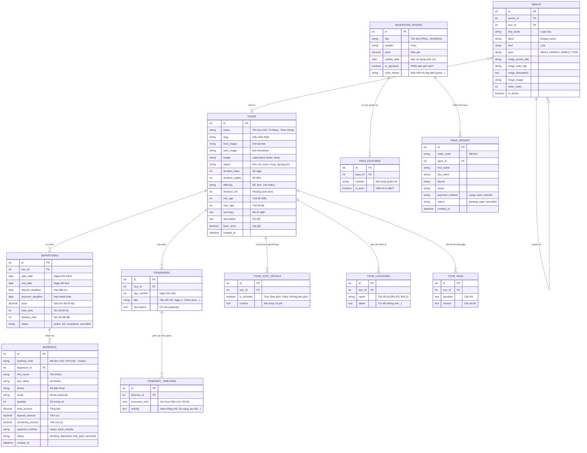

# Thiết Kế Cơ Sở Dữ Liệu (Database Schema)
Dự án: **Toong Adventure Clone**

Dựa trên tài liệu chức năng (`functional_system.md`), dưới đây là thiết kế chi sở dữ liệu quan hệ (RDBMS) dự kiến (sử dụng MySQL/PostgreSQL) để đáp ứng các tính năng của trang web.

## 1. Sơ Đồ Thực Thể Liên Kết (ERD)

## 2. Diễn Giải Các Bảng Chính

### 2.1 Bảng `tours`
Lưu trữ toàn bộ thông tin gốc, thông tin tra cứu cơ bản của tất cả các cung đường.
- **Trường quan trọng:** `slug`, `region` (để bộ lọc tìm kiếm hoạt động), `difficulty` (có thể kết nối với bảng Level nếu cần mở rộng, ở đây tạm thời lưu dạng chuỗi), `base_price` (giá tham khảo hiển thị trên card khi chưa chọn ngày).
- **Mở rộng (Recommendation):** Việc kết nối các Tour tương tự (Similar Tours) có thể thêm một bảng trung gian `similar_tours (tour_id, similar_tour_id)` nếu không muốn hệ thống tự động lọc theo `region` hay `difficulty`.

### 2.2 Bảng `departures` (Lịch khởi hành)
Mỗi tour sẽ có nhiều ngày khởi hành khác nhau. Client khi chọn trên Booking form sẽ call từ bảng này.
- **Trường quan trọng:** `start_date`, `end_date`, `price` (giá có thể biến động tùy dịp Lễ/Tết - không nhất thiết giống `base_price` của `tours`), `booked_slots` vs `total_slots` để chặn khách đặt khi đã đầy chỗ.

### 2.3 Bảng `bookings` (Đơn đặt chỗ)
Quản lý trạng thái mua vé cho 1 kỳ khởi hành cụ thể (`departure_id`).
- Hệ thống hỗ trợ VNPAY và Chuyển khoản nên cần lưu `payment_method`. Các tiến trình nộp tiền cọc và tất toán phần còn lại sẽ được lưu vết thay đổi vào mục `status` (`pending` -> `deposited` -> `fully_paid`).

### 2.4 Bảng `itineraries` và `itinerary_timelines` (Lịch trình & Dòng thời gian)
Phục vụ chức năng Accordion ở Tour Detail. Tách làm 2 cấp: Cấp "Ngày thứ X" và Cấp "Timeline Giờ Y". Việc phân chia này giúp API trả về cấu trúc mảng lồng nhau chuẩn xác cho Frontend map ra UI.

### 2.5 Các bảng bổ trợ cấu hình Tour Detail
- `tour_cost_details`: Dùng chung cho "Bao gồm" và "Không bao gồm" dựa trên cờ `is_included`.
- `tour_luggages` và `tour_faqs`: Dữ liệu độc lập đi kèm với mỗi Tour, giúp trang chi tiết không bị hardcode cứng. Khách hàng có thể cấu hình từ Admin Dashboard.

### 2.6 Module Adventure Pass (`adventure_passes`, `pass_features`, `pass_orders`)
Trường hợp thẻ bán theo gói hằng năm tách biệt với Đặt Tour. Bảng này quản lý thông tin các loại thẻ Pass, quyền lợi `features` từng dòng, và danh sách đơn mua `pass_orders`.

## 3. Lời Thuyên Về Hệ Thống Người Dùng (Users / Auth)
Dựa theo functional_system.md, hiện tại giao diện **không có trang Đăng nhập / Đăng ký cá nhân** và việc đặt Tour (Booking) chỉ yêu cầu điền thông tin liên hệ ngay trên Modal.
Do đó:
- Database hiện tại có thể chưa cần quản lý bảng `users` dành cho Client end-user, mà mọi thông tin liên hệ sẽ bám theo `bookings`.
- Tuy nhiên, hãy cân nhắc thêm bảng `users` cho những cá nhân có vai trò **Admin**, **System Manager** để có thể phát triển Admin CMS truy cập và quản lý các Đơn hàng (Bookings), Thêm mới Tour.

Về cấu trúc này sẽ hỗ trợ 100% cho các dữ liệu đang render trên Frontend hiện nay.
